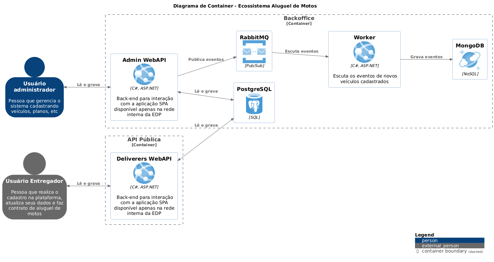

# Projeto de Locação de Motos

## Descrição

Este projeto é uma plataforma de locação de motos que permite aos administradores cadastrar motos e aos entregadores alugar motos. A aplicação é composta por duas APIs: API Admin e API Deliverers e um Worker.

## Arquitetura



## Funcionalidades

### API Admin

- **Cadastrar uma nova moto**
  - Dados obrigatórios: Fabricante, Modelo, Placa e Ano.
  - A placa é um dado único e não pode se repetir.
  - Gera um evento de moto cadastrada.
  - Publica a notificação por mensageria.
  - Consumidor notifica quando o ano da moto for "2024" e armazena a mensagem no banco de dados para consulta futura.

- **Consultar motos existentes**
  - Permite filtrar as motos pela placa.

- **Modificar uma moto**
  - Permite alterar apenas a placa de uma moto cadastrada indevidamente.

- **Remover uma moto**
  - Permite remover uma moto que foi cadastrada incorretamente, desde que não tenha registro de loca��es.


### API Deliverers
- **Cadastrar entregador**
  - Dados do entregador: Identificador, Nome, CNPJ, Data de Nascimento, Número da CNH, Tipo da CNH, Imagem da CNH.
  - Tipos de CNH válidos: A, B ou ambas A+B.
  - O CNPJ é único e não pode se repetir.
  - O n�mero da CNH é único e não pode se repetir.

- **Enviar foto da CNH**
  - Formatos permitidos: PNG ou BMP.
  - A foto não deve armazenada no banco de dados, mas em um serviço de storage (disco local, Amazon S3, MinIO ou outros).

- **Alugar uma moto**
  - Planos disponíveis:
    - 7 dias com um custo de R$30,00 por dia.
    - 15 dias com um custo de R$28,00 por dia.
    - 30 dias com um custo de R$22,00 por dia.
    - 45 dias com um custo de R$20,00 por dia.
    - 50 dias com um custo de R$18,00 por dia.
  - A locação deve ter uma data de início, uma data de término e uma data de previsão de término.
  - O início da locação é o primeiro dia ap�s a data de criação.
  - Somente entregadores habilitados na categoria A podem efetuar uma locação.

- **Informar data de devolução e consultar valor total da loca��o**
  - Permite informar a data de devolução da moto e consultar o valor total da locação.

## Como Rodar Localmente

### Pré-requisitos

- Docker
- Docker Compose

### Passos para Rodar

1. Clone o reposit�rio:
   ```bash
   git clone https://github.com/patricksegantine/desafio-aluguel-motos.git
   cd seu-repositorio
   ```
2. Configure o arquivo appsettings.json com as informações necessárias, incluindo o caminho de armazenamento para as fotos da CNH.

3. Execute o Docker Compose para iniciar os serviços de infraestrutura:
   ```bash
   docker compose up -d
   ```

Isso irá iniciar os serviços do RabbitMQ, MongoDB, PostgreSQL e PgAdmin. O banco de dados será criado automaticamente e as migrations serão executadas automaticamente quando você executar a API Admin.

4. Abra o Visual Studio e execute as aplicações. Acesse a API Admin e a API Deliverers conforme necessário para utilizar as funcionalidades descritas acima.

### Contribuição

Sinta-se à vontade para contribuir com o projeto. Para isso, façaa um fork do repositório, crie uma branch para suas alterações e envie um pull request.

### Licença

Este projeto está licenciado sob a licença MIT. Veja o arquivo LICENSE para mais detalhes